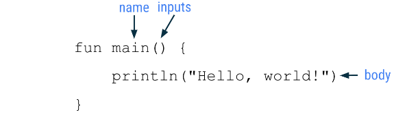

# Kotlin Google Android avec Compose

## Premier programme avec Kotlin

    fun main() {
        println("Hello, world!")
    }

Comment ça marche ? 
**Un programme Kotlin doit disposer d'une fonction principale, qui correspond à l'endroit précis de votre code où commence le compilateur Kotlin. La fonction principale est le point d'entrée (ou point de départ) du programme.**

### Composantes d'une fonction

Une fonction est un segment d'un programme qui exécute une tâche spécifique. Votre programme peut avoir une seule ou plusieurs fonctions.

#### Définir vs appeler une fonction

Dans votre code, vous commencez par **définir ou déclarer une fonction**. Vous devez donc spécifier toutes les instructions nécessaires pour effectuer cette tâche.
Une fois la fonction définie, vous pouvez l'**appeler** afin que les instructions qu'elle contient soient effectuées ou exécutées.

##### Définir une fonction

Voici les éléments clés nécessaires pour définir une fonction :

- La fonction a besoin d'un **nom** pour que vous puissiez l'appeler plus tard.
- La fonction peut également nécessiter des entrées ou des informations à fournir une fois appelée. La fonction utilise ces entrées pour remplir son objectif. Les entrées sont facultatives, et certaines fonctions ne nécessitent aucune entrée.
- La fonction comporte également un **corps**, qui contient les instructions pour effectuer la tâche.

Retenez les éléments clés d'une fonction présentés dans l'exemple d'une fonction principale que vous avez vu dans Kotlin Playground :

- **La définition de la fonction commence par le mot fun**.
- Le nom de la fonction est alors main.
-Comme il n'existe aucune entrée pour la fonction, les parenthèses sont vides.
- Le corps de la fonction contient une ligne de code, println("Hello, world!"), située entre les accolades d'ouverture et de fermeture de la fonction.

**fun** = mot clef d'une fonction.
Le nom est généralement un verbe, ou expression verbale. camel case! en minuscule.

### Guide de style

Tout au long de ce cours, vous découvrirez les bonnes pratiques de codage à suivre en tant que développeur Android. L'une de ces bonnes pratiques consiste à suivre les normes de codage Android de Google pour le codage en Kotlin. Le guide complet, appelé "guide de style", explique comment mettre en forme le code en termes d'aspect visuel et les conventions à suivre lors de sa rédaction. Par exemple, le guide de style inclut des recommandations sur l'utilisation des espaces, des retraits, des noms, etc.

Voici quelques recommandations du guide de style utiles pour ce que vous avez appris en Kotlin jusqu'à présent :

- Les noms de fonctions doivent être en camel case et être des verbes ou des expressions verbales.
- Chaque instruction doit figurer sur une ligne distincte.
- L'accolade ouvrante doit apparaître à la fin de la ligne où la fonction commence.
- **Il doit y avoir une espace avant l'accolade ouvrante**.
- Le corps de la fonction doit être en retrait de **4 espaces**. N'utilisez pas de tabulation pour mettre votre code en retrait. Saisissez quatre espaces.
- L'accolade fermante se trouve sur sa propre ligne après la dernière ligne de code dans le corps de la fonction.
- L'accolade doit être alignée sur le mot clé fun au début de la fonction.

### Erreur dans le code

Si la compilation du code échoue, cela signifie qu'une erreur s'est produite. Par exemple, si vous avez fait une faute de frappe, vous avez par exemple oublié un guillemet ou une parenthèse, le compilateur ne comprendra pas votre code et ne pourra pas le traduire en étapes pour que l'ordinateur fonctionne correctement. Si votre code ne fonctionne pas comme prévu ou qu'un message d'erreur s'affiche dans votre éditeur de code, vous devez revenir au code et le corriger. Le processus de résolution de ces erreurs s'appelle le dépannage.

Les messages d'erreur commencent par le mot "**Expecting**" (Attente), car le compilateur Kotlin "attend" quelque chose, mais ne le trouve pas dans le code. Dans ce cas, le compilateur attend un guillemet fermant et une parenthèse fermante pour le code dans la deuxième ligne de votre programme.

## Créer et utiliser des variables en Kotlin

### Définir et appeler des fonctions

Bien que Kotlin vous permette de placer tout votre code dans la fonction main(), cette approche n'est pas toujours conseillée. Par exemple, si vous souhaitez également que votre programme contienne le message "Bonne année", la fonction principale devra également inclure ces appels à println(). Ou peut-être voulez-vous souhaiter un joyeux anniversaire à Rover plusieurs fois. Dans ce cas, vous pouvez simplement copier et coller le code, ou créer une fonction distincte pour le message d'anniversaire. La deuxième approche est celle que vous allez utiliser. La création de fonctions distinctes pour des tâches spécifiques présente plusieurs avantages.

Code réutilisable : au lieu de copier et coller le code dont vous avez besoin plusieurs fois, vous pouvez appeler une fonction chaque fois que nécessaire.
Lisibilité : lorsque vous vous assurez que les fonctions effectuent une tâche bien spécifique, les autres développeurs, vos collègues et vous-même savez toujours exactement ce à quoi sert l'extrait de code.

    fun main() {
        println("Happy Birthday, Rover!")
        println("You are now 5 years old!")
    }

    fun main() {
        birthdayGreeting()
    }

    fun birthdayGreeting() {
        println("Happy Birthday, Rover!")
        println("You are now 5 years old!")
    }

### Renvoyer une valeur à partir d'une focntion

Les fonctions Kotlin peuvent également générer des données appelées valeur de retour, qui sont stockées dans une variable que vous pouvez utiliser ailleurs dans le code.
Lorsque vous définissez une fonction, vous pouvez spécifier le type de données de la valeur à renvoyer. Pour spécifier le type renvoyé, placez deux-points (:) après les parenthèses et le nom d'un type (Int, String, etc.) après les deux-points. Un seul espace est placé après le type renvoyé et avant l'accolade d'ouverture. Dans le corps de la fonction, après toutes les instructions, utilisez une instruction return pour spécifier la valeur que la fonction doit renvoyer. Une instruction return se compose du mot clé return suivi de la valeur (une variable, par exemple) que la fonction doit renvoyer comme résultat. 

    fun birthdayGreeting(): Unit {
        println("Happy Birthday, Rover!")
        println("You are now 5 years old!")
    }
    fun name(): return type {
        body
        return statement
    }

**Type unit**:
Par défaut, si vous ne spécifiez pas de type renvoyé, le type par défaut est **Unit**. Unit signifie que la fonction ne renvoie pas de valeur. Unit équivaut à des types renvoyés vides dans d'autres langages (void en Java et C, Void/tuple vide () en Swift, None en Python, etc.). Toute fonction qui ne renvoie pas de valeur renvoie implicitement Unit.

    fun main() {
        birthdayGreeting()
    }

    fun birthdayGreeting(): Unit {
        println("Happy Birthday, Rover!")
        println("You are now 5 years old!")
    }

    fun main() {
        birthdayGreeting()
    }

    fun birthdayGreeting(): String {
        println("Happy Birthday, Rover!")
        println("You are now 5 years old!")
    }
    => erreur car pas d'instruction return

        fun main() {
            val greeting = birthdayGreeting()
            println(greeting)
    }

    fun birthdayGreeting(): String {
        val nameGreeting = "Happy Birthday, Rover!"
        val ageGreeting = "You are now 5 years old!"
        return "$nameGreeting\n$ageGreeting"
    }

    fun main() {
            println(birthdayGreeting())
    }

    fun birthdayGreeting(): String {
        val nameGreeting = "Happy Birthday, Rover!"
        val ageGreeting = "You are now 5 years old!"
        return "$nameGreeting\n$ageGreeting"
    }

### Ajouter un paramètre à la fonction birthdayGreeting()

Comme vous avez pu le constater, lorsque vous appelez println(), vous pouvez inclure une chaîne entre parenthèses ou transmettre une valeur à la fonction. Vous pouvez faire de même avec la fonction birthdayGreeting(). Toutefois, vous devez d'abord ajouter un paramètre à birthdayGreeting().

Un paramètre spécifie le nom d'une variable et un type de données que vous pouvez transmettre à une fonction en tant que données accessibles au sein de cette fonction. Les paramètres sont déclarés entre parenthèses après le nom de la fonction.

    fun name(parameters): return type {
        body
    }

Chaque paramètre comprend un nom de variable et un type de données, séparés par le signe deux-points et un espace. Pour utiliser plusieurs paramètres, séparez-les par une virgule.

    fun birthdayGreeting(name: String): String {
        val nameGreeting = "Happy Birthday, Rover!"
        val ageGreeting = "You are now 5 years old!"
        return "$nameGreeting\n$ageGreeting"
    }

    fun main() {
        println(birthdayGreeting("Rover"))
    }

    fun birthdayGreeting(name: String): String {
        val nameGreeting = "Happy Birthday, $name!"
        val ageGreeting = "You are now 5 years old!"
        return "$nameGreeting\n$ageGreeting"
    }

>Remarque : Bien qu'ils soient souvent utilisés de façon interchangeable, un paramètre et un argument sont deux concepts distincts. Lorsque vous définissez une fonction, vous spécifiez les paramètres qui peuvent lui être transmis. Lorsque vous appelez une fonction, vous transmettez des arguments correspondant aux paramètres. Les paramètres sont les variables accessibles à la fonction, comme une variable name, tandis que les arguments sont les valeurs réelles que vous transmettez, comme la chaîne "Rover".

**Avertissement : Contrairement à d'autres langages comme Java, où une fonction peut modifier la valeur transmise à un paramètre, les paramètres Kotlin sont immuables. Vous ne pouvez pas réattribuer la valeur d'un paramètre à partir du corps de la fonction.**

### Fonctions avec plusieurs paramètres

## Sources

[Google dev](https://developer.android.com/codelabs/basic-android-kotlin-compose-first-program?hl=fr&continue=https%3A%2F%2Fdeveloper.android.com%2Fcourses%2Fpathways%2Fandroid-basics-compose-unit-1-pathway-1%3Fhl%3Dfr%23codelab-https%3A%2F%2Fdeveloper.android.com%2Fcodelabs%2Fbasic-android-kotlin-compose-first-program#3)